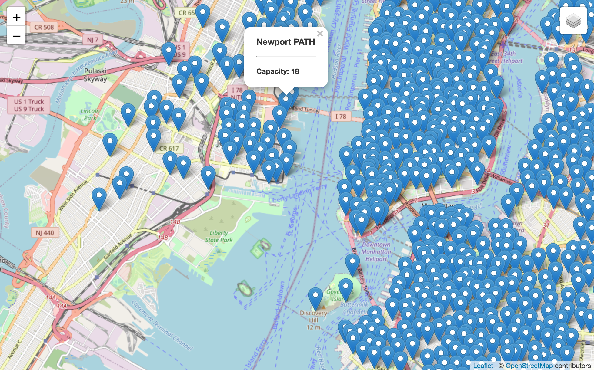

# Citi Bike Maps

This is a mini project on Leaflet. Citi Bike API is used to get the status and location of every Citi Bike station in New York. The following steps are followed.

## steps

* [Citi Bike station information endpoint](https://gbfs.citibikenyc.com/gbfs/en/station_information.json) is used to get information about the station names and locations. 

* Each object in the `stations` array has `station_id`, `name`, `capacity`, `lat`, and `lon` properties.

* A function named `createMap` was  created that takes `bikeStations` as an argument. This function created both the tile layer and an overlay with the pins for each station.

* Using d3, json data was retrieved from the [Citi Bike station information endpoint](https://gbfs.citibikenyc.com/gbfs/en/station_information.json).

The following image shows the basic map:

*[GitHub Page link](https://tamasree.github.io/citi_bike_project/)

## Hint

* Make sure that you run `python -m http.server` in the folder that contains your files. Because you'll do all the work on the front end of your app, you won't need to restart the router for any changes that you make.

* Here are some helpful links:

  * [Leaflet map example](https://leafletjs.com/reference-1.7.1.html#map-example)
  * [Citi Bike station information API endPoint](https://gbfs.citibikenyc.com/gbfs/en/station_information.json)
  * [Leaflet popup documentation](http://leafletjs.com/reference.html#popup)
  * [Citi Bike station status API endPoint](https://gbfs.citibikenyc.com/gbfs/en/station_status.json)
  * [Leaflet layer groups documentation](http://leafletjs.com/examples/layers-control/)
  * [Leaflet.ExtraMarkers](https://github.com/coryasilva/Leaflet.ExtraMarkers)
  * [Leaflet legend documentation](http://leafletjs.com/examples/choropleth/#custom-legend-control)
  
## Contact Info
*[Linkedin Link](www.linkedin.com/in/tamasree-sinha)
*[Email id](tamasree.g@gmail.com)
